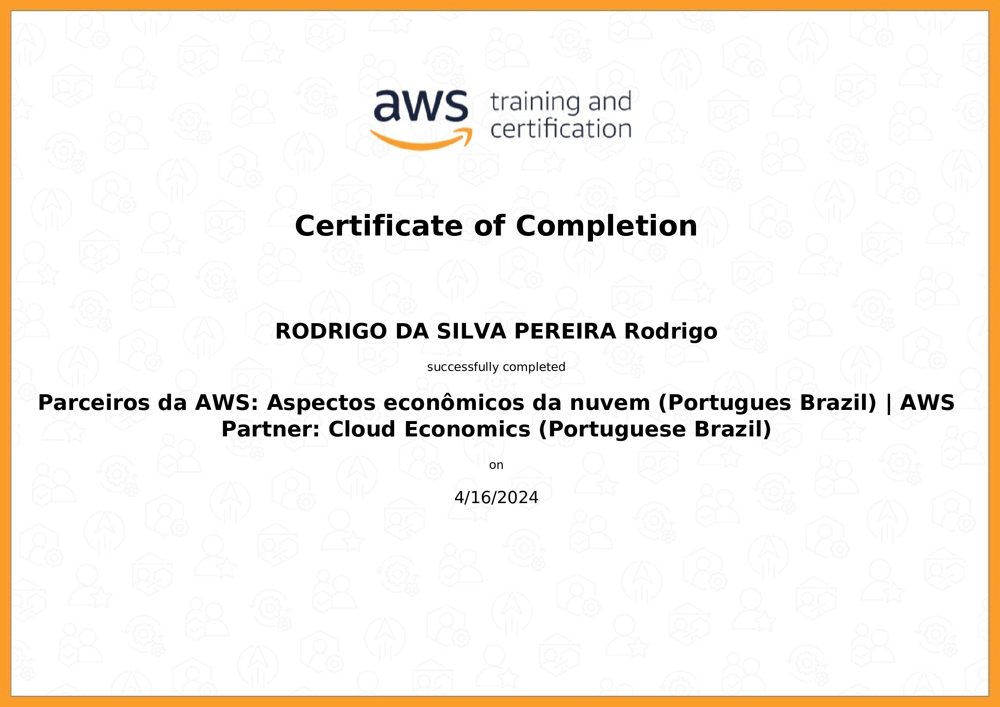

# Entregas da Sprint Atual

Neste arquivo você irá encontrar entregas da Sprint corrente. Observe que existem 4 diretórios para analisar referente a autal sprint: **exercícios**, **certificados**, **desafio** e **evidências**.

 - O diretório **exercícios** corresponde ao local onde você irá encontrar o código-fonte das atividades de codificação da Sprint, quando houver.
 - O diretório **evidências** você pode encontrar imagens ou vídeos demonstrando a execução/resultados de atividades, quando necessário.
 - O diretório **certificados** é o local onde você irá encontrar certificados dos cursos solicitados durante a sprint. O nome de cada certificado corresponde ao título do curso.
 - O diretório **desafio** é o local onde você irá encontrar a resolução do que se pede no desafio, todos recursos que são considerados importantes para a resolução do desafio você encontra aqui.

# Exercícios

Os exercícios conistem em uma série de atividades no decorrer das seções realizadas no curso de SQL durante a Sprint 2. Nesta seção é possível entender em Python como ler dados de um arquivo CSV, processá-los para extrair informações relevantes, ordenar os dados com base em critérios e escrever o resultado em um novo arquivo de texto. Aprendemos sobre manipulação de arquivos CSV, tratamento de erros, ordenação de dados e escrita em arquivos, tudo encapsulado em uma função reutilizável. Essas habilidades são úteis para análise e processamento de dados em Python.

1. Exercícios referentes a seção 5:

[Exercício 1 referente a ETL Python](Exercicios/Seção_5/1_ETL_Python.py)

[Exercício 2 referente a ETL Python](Exercicios/Seção_5/2_ETL_Python.py)

[Exercício 3 referente a ETL Python](Exercicios/Seção_5/3_ETL_Python.py)

[Exercício 4 referente a ETL Python](Exercicios/Seção_5/4_ETL_Python.py)

[Exercício 5 referente a ETL Python](Exercicios/Seção_5/5_ETL_Python.py)

# Evidências

Não foi necessário a utilização do diretório Evidências, pois no desafio consta a imagem nos códigos.

# Certificados

