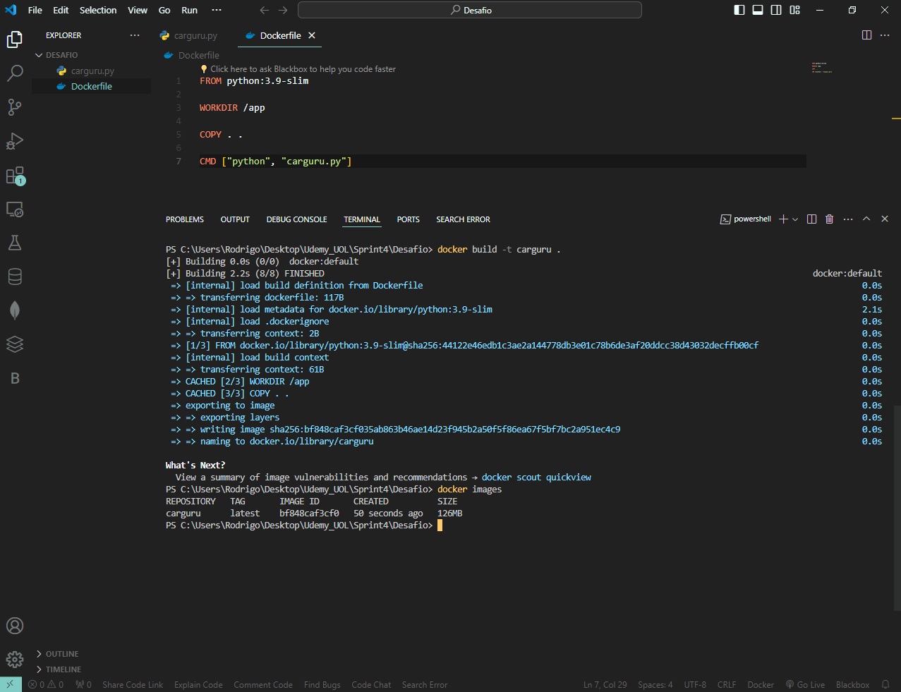
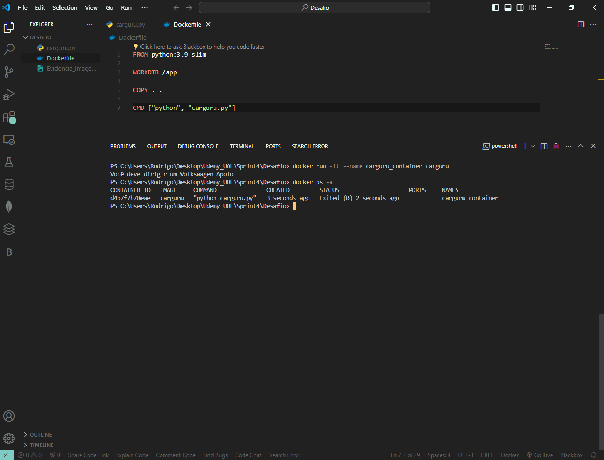
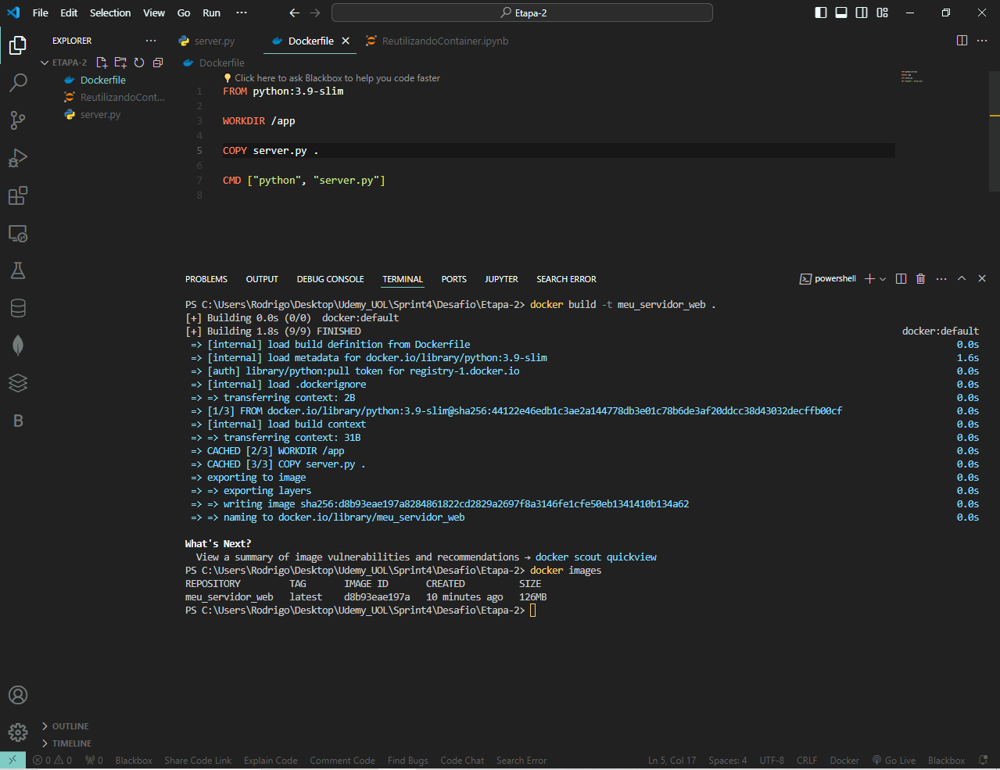
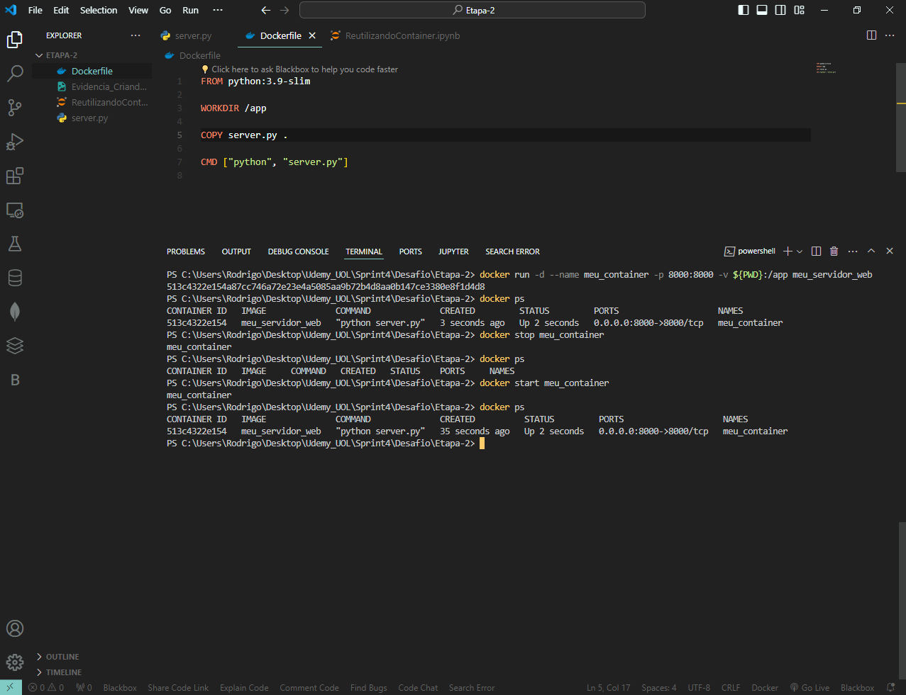
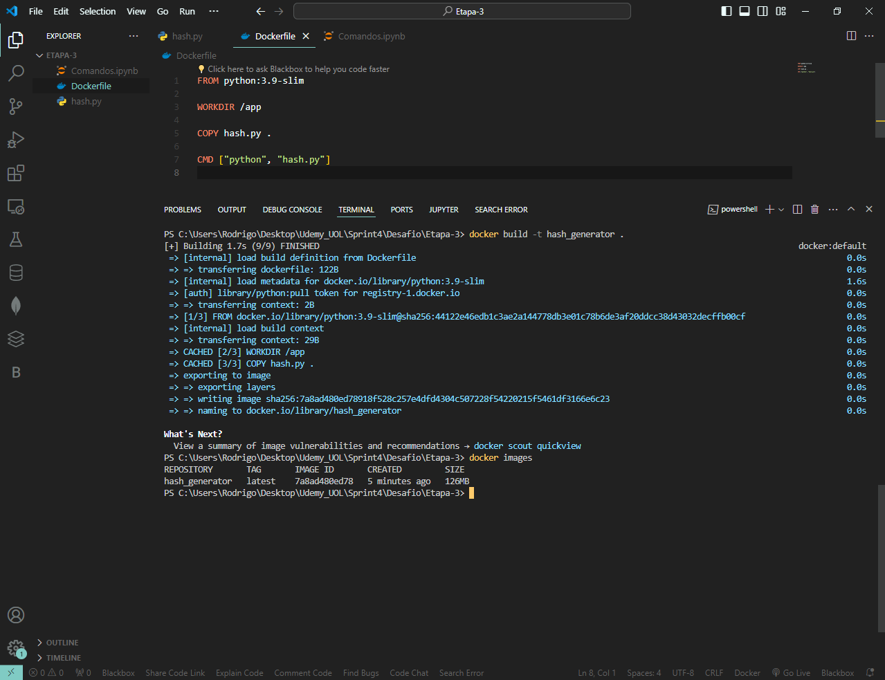
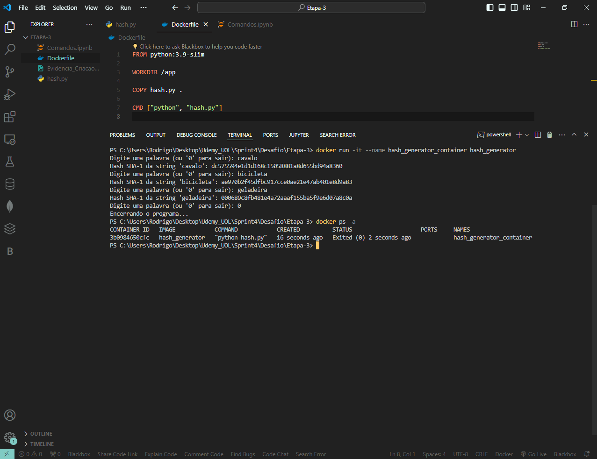

# Entregas da Sprint Atual

Neste arquivo você irá encontrar entregas da Sprint corrente. Observe que existem 4 diretórios para analisar referente a autal sprint: **exercícios**, **certificados**, **desafio** e **evidências**.

 - O diretório **exercícios** corresponde ao local onde você irá encontrar o código-fonte das atividades de codificação da Sprint, quando houver.
 - O diretório **evidências** você pode encontrar imagens ou vídeos demonstrando a execução/resultados de atividades, quando necessário.
 - O diretório **certificados** é o local onde você irá encontrar certificados dos cursos solicitados durante a sprint. O nome de cada certificado corresponde ao título do curso.
 - O diretório **desafio** é o local onde você irá encontrar a resolução do que se pede no desafio, todos recursos que são considerados importantes para a resolução do desafio você encontra aqui.

# Exercícios

Não houveram exercícios além dos propostos no desafio.

# Evidências

Durante a execução dos comandos, foi necessário realizar "prints" da tela para demonstrar evidências de sua execução, cada etapa possui suas rescpetivas evidências:

### Evidências do Curso de Docker

Nesta seção, apresento evidências das principais etapas do curso de Docker, demonstrando minhas habilidades na criação e gerenciamento de contêineres.

#### Etapa 1: Criação da Imagem Docker e Execução do Container

Na primeira etapa do curso, foi criado um Dockerfile a partir de um arquivo .py. A imagem foi baseada em uma aplicação de exemplo chamada "Carguru". Em seguida, executei um container a partir dessa imagem, demonstrando a capacidade de transformar uma aplicação em um container isolado e executável.

#### Etapa 2: Reutilização de Imagens e Containers Docker

Na segunda etapa do curso, aprofundei meu conhecimento ao explorar a reutilização de containers Docker. Comecei criando uma nova imagem a partir de um código criado para o teste de reutilização, demonstrando como podemos construir novas versões de nossas aplicações de forma eficiente. Em seguida, executei novamente o container, mostrando como podemos reutilizar e compartilhar containers entre diferentes ambientes de desenvolvimento e produção.

#### Etapa 3: Orquestração do zero de container

Na etapa final do curso, explorei meus conhecimentos e criei um script Python e sua solução Docker para execução. Comecei criando uma nova imagem para uma aplicação mais complexa e, em seguida, usei o Docker Compose para definir e executar seu serviço.

# Certificados

%20(Portugues).pdf)
