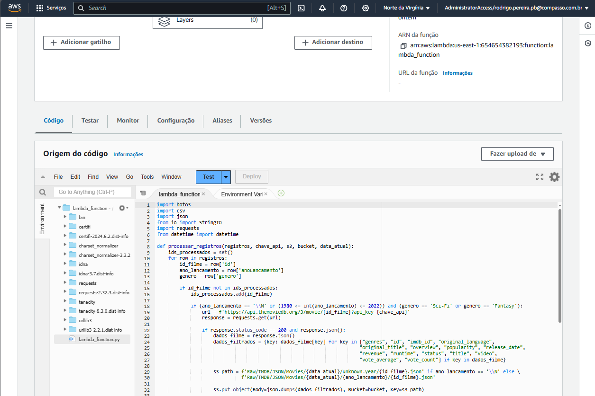

# Entregas da Sprint Atual

Neste arquivo você irá encontrar entregas da Sprint corrente. Observe que existem 4 diretórios para analisar referente a autal sprint: **exercícios**, **desafio** e **evidências**.

- O diretório **exercícios** corresponde ao local onde você irá encontrar o código-fonte das atividades de codificação da Sprint, quando houver.
- O diretório **evidências** você pode encontrar imagens ou vídeos demonstrando a execução/resultados de atividades, quando necessário.
- O diretório **desafio** é o local onde você irá encontrar a resolução do que se pede no desafio, todos recursos que são considerados importantes para a resolução do desafio você encontra aqui.

## Exercícios

Este diretório apresenta um laboratório focado na criação de jobs no AWS Glue, desenvolvido como parte do curso da AWS durante a Sprint 7. Os participantes exploraram serviços-chave da AWS, incluindo lambda e IAM, aplicando-os de forma prática com evidências claras. Aprendemos a manipular arquivos, bancos e parâmetros, além de executar scripts, habilidades cruciais para análise e processamento de dados na nuvem.

1. Evidências referentes aos exercícios:

   - [Criação do Bucket com dados a serem analisados](Exercicios/Criando_Bucket.png)
   - [Criando IAM Roles para rodar job](Exercicios/Criando_IAM_Roles.png)
   - [Executando o Job](Exercicios/Execução_Job.png/)

## Evidências

Nesta seção, você encontrará evidências da execução do código e do desafio.

### Execução do Dockerfile e Código Principal

### Arquivos enviados após requisição da API

### Estrutura JSON

## Certificados

## Desafio

Nesta seção, você encontrará a resolução do desafio proposto, juntamente com todos os recursos importantes para a sua execução.

### Resumo do Desafio

O desafio consistiu na criação de um script Python para gerenciar dados de filmes no Amazon S3. O script faz o upload de arquivos CSV locais para um bucket específico no S3, organizando os dados com base na data de processamento. Utilizando bibliotecas como boto3 para interação com serviços da AWS e csv para manipulação de arquivos CSV, o código lê o conteúdo do CSV, processa os registros filtrando por ano de lançamento e gênero específicos ('Sci-Fi' e 'Fantasy'), e salva os dados relevantes em formato JSON no S3. O script também integra uma função lambda_handler para ser executado como função AWS Lambda, garantindo processamento escalável e eficiente dos dados.

