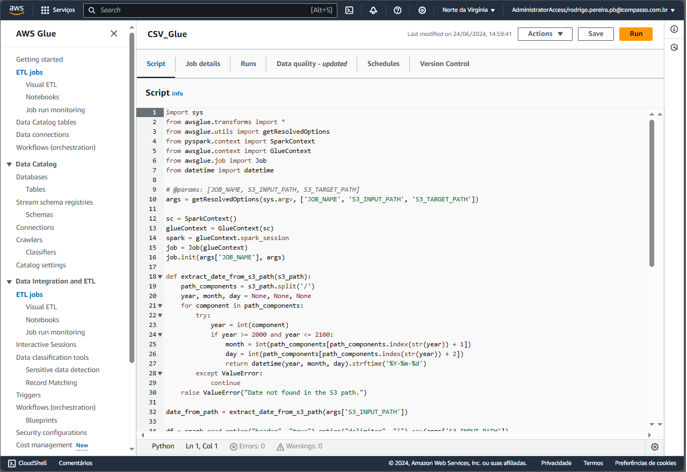
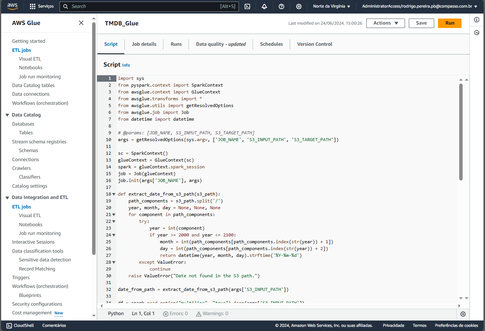
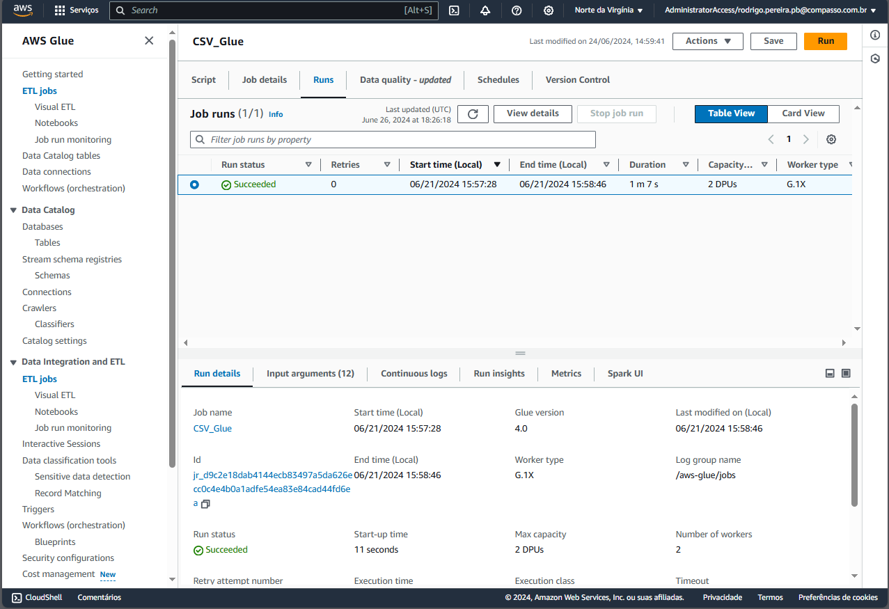
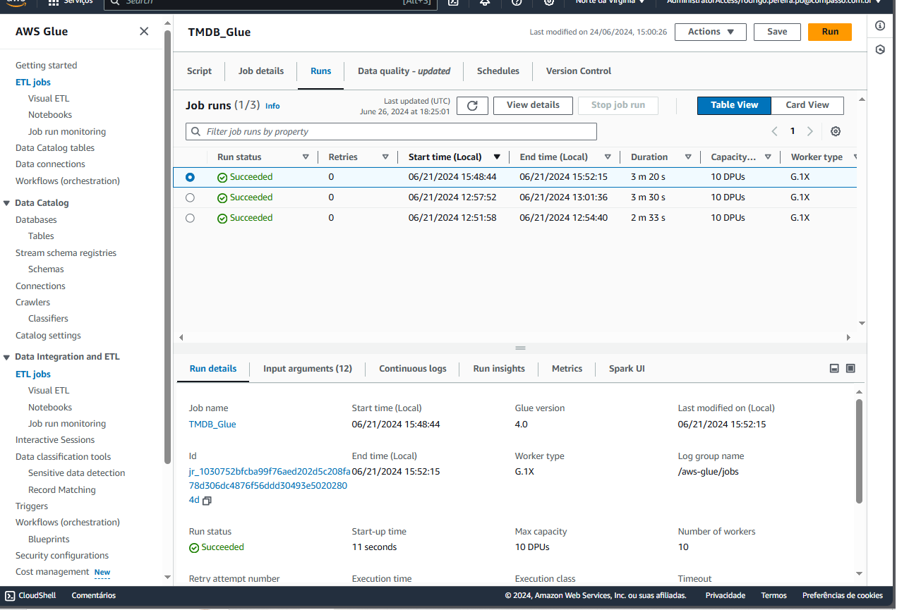
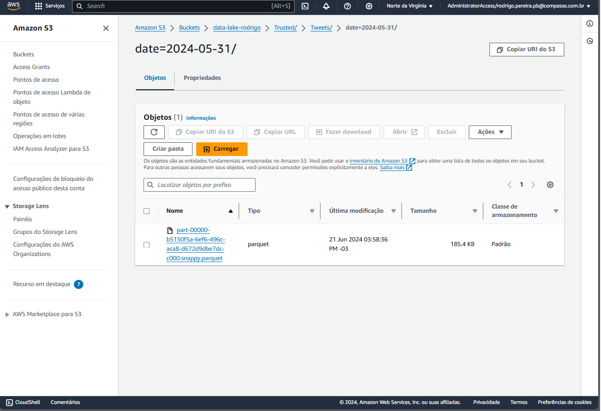
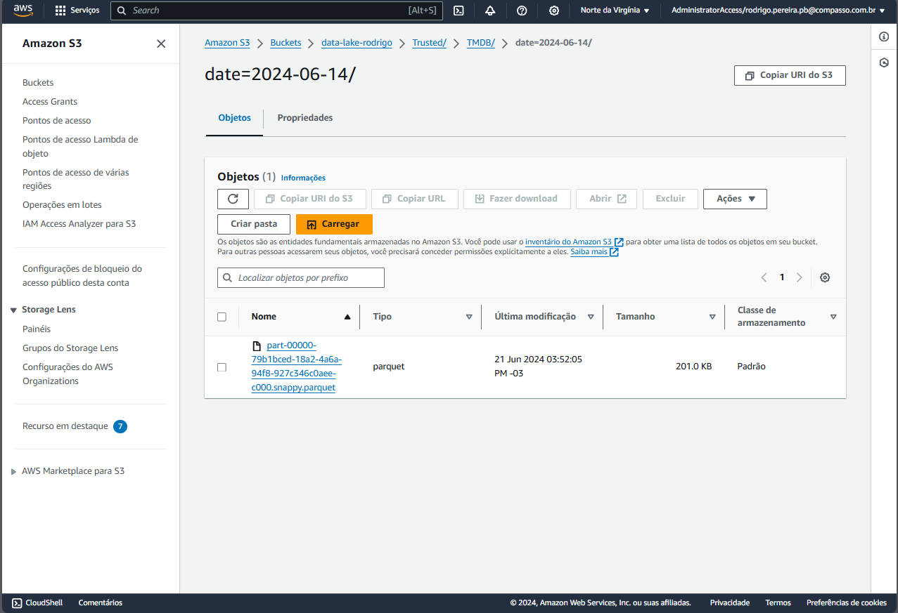

# Entregas da Sprint Atual

Neste arquivo você irá encontrar entregas da Sprint corrente. Observe que existem 4 diretórios para analisar referente a autal sprint: **exercícios**, **desafio** e **evidências**.

- O diretório **exercícios** corresponde ao local onde você irá encontrar o código-fonte das atividades de codificação da Sprint, quando houver.
- O diretório **evidências** você pode encontrar imagens ou vídeos demonstrando a execução/resultados de atividades, quando necessário.
- O diretório **desafio** é o local onde você irá encontrar a resolução do que se pede no desafio, todos recursos que são considerados importantes para a resolução do desafio você encontra aqui.

## Exercícios

Este diretório apresenta um laboratório focado na criação de scripts no PySpark, para manipulação de arquivos desenvolvido como parte do curso da AWS durante a Sprint 8. Foram explorados diversos recursos oferecidos pela ferramenta Spark com a finalidade de oferecer novas vertentes de análise de dados. Aprendendo a manipular arquivos, bancos e parâmetros, além de executar scripts, habilidades cruciais para análise e processamento de dados na nuvem.

1. Evidências referentes aos exercícios:

   - [Exercício 1 - Spark - Warm_up_1](Exercicios/SPARK/exercicio_1/warm_up_1/warm_up_01.py)
   - [Exercício 1 - Spark - Warm_up_2](Exercicios/SPARK/exercicio_1/warm_up_2/warm_up_02.py)
   - [Exercício 1 - Spark - Geração de Massa](Exercicios/SPARK/exercicio_1/Geracao_massa.py)
   - [Exercicio 2 - Spark - Manipulando Banco](Exercicios/SPARK/exercicio_2/apache-spark.ipynb)
   - [Exercicio 3 - TMDB - API](Exercicios/TMDB/script.py)

## Evidências

Nesta seção, você encontrará evidências da execução do código e do desafio.

### Script utilizado na extração de dados do CSV

### Script utilizado na extração de dados do TMDB

### Demonstração de Execução do Job Glue na extração de dados do CSV

### Demonstração de Execução do Job Glue na extração de dados do TMDB

### Análise do arquivo gerado dentro do S3 - CSV

### Análise do arquivo gerado dentro do S3 - TMDB

## Certificados

## Desafio

Nesta seção, você encontrará a resolução do desafio proposto, juntamente com todos os recursos importantes para a sua execução.

### Resumo do Desafio

O desafio consistiu na criação de scripts Python para gerenciar dados de filmes no Amazon S3 utilizando AWS Glue e Spark. Os scripts realizam a leitura e transformação de dados CSV e JSON, carregando-os em formato Parquet em um bucket específico no S3, organizando os dados com base na data de processamento. Utilizando bibliotecas como PySpark e AWS Glue, o código lê o conteúdo dos arquivos, processa os registros filtrando por critérios específicos (como gênero 'Sci-Fi' e 'Fantasy' para CSV e diversas transformações para JSON), e salva os dados relevantes em formato Parquet no S3. Os scripts são configurados para serem executados como jobs no AWS Glue, garantindo processamento escalável e eficiente dos dados.

